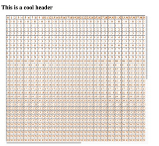
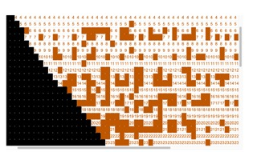
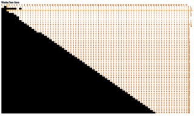

# Large Table Layout

## User Story

This table was created as starter code for two different projects for UT austin Full Stack coding boot camp. JavaScript was used in the project to fill individual cell's with color based on data obtained from an API call. Each row and column has a unique id and class and can be modified based on the projects needs.

## Table of Contents

[Images](#images)

[Projects-Used-In](#projects-table-is-used-in)

[License](#license)

[Language-and-Tools](#language-and-tools)

## Images

The first image is starter code from this repo, second image is the first project it was used in. The third image is from the second project that a hover effect was added and the scroll bar was removed from the table. Both projects are linked below.

## Projects Table is Used In

[Big-12-Scorigami](https://github.com/KlyDesign/Big12-Scorigami)

[Scororama](https://github.com/jhammer22/omaha)

## License

MIT License
  
  

## Language and Tools

